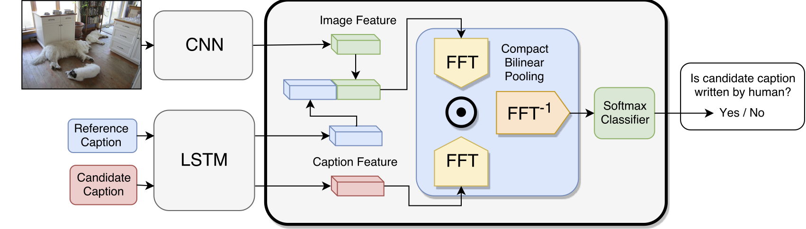

# Learning to Evaluate Image Captioning
TensorFlow implementation for the paper:

[*Learning to Evaluate Image Captioning*](https://vision.cornell.edu/se3/wp-content/uploads/2018/03/1501.pdf)\
[Yin Cui](http://www.cs.cornell.edu/~ycui/), [Guandao Yang](http://www.guandaoyang.com/), [Andreas Veit](https://www.cs.cornell.edu/~andreas/), [Xun Huang](http://www.cs.cornell.edu/~xhuang/), [Serge Belongie](http://blogs.cornell.edu/techfaculty/serge-belongie/)\
CVPR 2018

This repository contains a discriminator that could be trained to evaluate image captioning systems. The discriminator is trained to distinguish between machine generated captions and human written ones. During testing, the trained discriminator take the cadidate caption, the reference caption, and optionally the image to be captioned as input. Its output probability of how likely the candidate caption is human written can be used to evaluate the candidate caption. Please refer to our paper [[link]](https://vision.cornell.edu/se3/wp-content/uploads/2018/03/1501.pdf) for more detail.

<p align="center">
  
</p>


## Dependencies

+ Python (2.7)
+ Tensorflow (>1.4)
+ OpenCV
+ PyTorch (for extracting ResNet image features.)
+ ProgressBar
+ NLTK

## Preparation

1. Clone the dataset with recursive (include the bilinear pooling)
```bash
git clone --recursive https://github.com/richardaecn/cvpr18-caption-eval.git
```
2. Install dependencies. Please refer to TensorFlow, PyTorch, NTLK, and OpenCV's official websites for installation guide. For other dependencies, please use the following:
```bash
pip install -r requirements.txt
```

3. Download data. This script will download needed data. The detailed description of the data can be found in "./download.sh".
```bash
./download.sh
```

4. Generate vocabulrary.
```bash
python scripts/preparation/prep_vocab.py
```

5. Extract image features. Following script will download COCO dataset and ResNet checkpoint, then extract image features from COCO dataset using ResNet. This might take few hours.
```bash
./download_coco_dataset.sh
cd scripts/features/
./download.sh
python feature_extraction_coco.py --data-dir ../../data/ --coco-img-dir ../../data
```

Alternatively, we provide a [[link]](https://drive.google.com/open?id=1G8Lj1zsUW5G2Z_ohtqN1ZeDEkWbrQ1jC) to download features extracted from ResNet152. Please put all *.npy files under "./data/resnet152/".

## Evaluation

To evaluate the results of an image captioning method, first put the output captions of the model on COCO dataset into the following JSON format:

```json
{
    "<file-name-1>" : "<caption-1>",
    "<file-name-2>" : "<caption-2>",
    ...
    "<file-name-n>" : "<caption-n>",
}
```

Note that ```<caption-i>``` are caption represented in text, and the file name is the name for the file in the image. The caption should be all lower-cased and have no ```\n``` at the end. Examples of such files by running open sourced [NeuralTalk](https://github.com/karpathy/neuraltalk2), [Show and Tell](https://github.com/tensorflow/models/tree/master/research/im2txt) and [Show, Attend and Tell](https://github.com/yunjey/show-attend-and-tell) can be found in the ```examples``` folder: ```examples/neuraltalk_all_captions.json```, ```examples/showandtell_all_captions.json```, ```examples/showattendandtell_all_captions.json```, and ```examples/human_all_captions.json```.

Make sure you have NLTK Punkt sentence tokenizer installed:
```python
import nltk
nltk.download('punkt')
```

Following command prepared the data so that it could be used for training:

```bash
python scripts/preparation/prep_submission.py --submission examples/neuraltalk_all_captions.json  --name neuraltalk
```

Note that we assume you've followed through the steps in the *Preparation* section before running this command. This script will create a folder `data/neuraltalk` and three ```.npy``` files that contain data needed for training the metric. Please use the following command to train the metric:

```bash
python score.py --name neuraltalk
```

The results will be logged in `model/neuraltalk_scoring` directory. If you use the default model architecture, the results will be in `model/neuraltalk_scoring/mlp_1_img_1_512_0.txt`.

Followings are the scores for three submissions (calculated as the averaged score among last 10 epochs). Notice that scores might be slightly different due to randomization in training.

| Architecture         | Epochs | [NeuralTalk](https://github.com/karpathy/neuraltalk2) | [Show and Tell](https://github.com/tensorflow/models/tree/master/research/im2txt) | [Show, Attend and Tell](https://github.com/yunjey/show-attend-and-tell) |
|----------------------|--------|------------|---------------|-----------------------|
| mlp_1_img_1_512_0    | 30     | 0.038      | 0.056         | 0.077                 |


## Citation
If you find our work helpful in your research, please cite it as:
```latex
@inproceedings{Cui2018CaptionEval,
  title = {Learning to Evaluate Image Captioning},
  author = {Yin Cui, Guandao Yang, Andreas Veit, Xun Huang, and Serge Belongie},
  booktitle={CVPR},
  year={2018}
}
```
